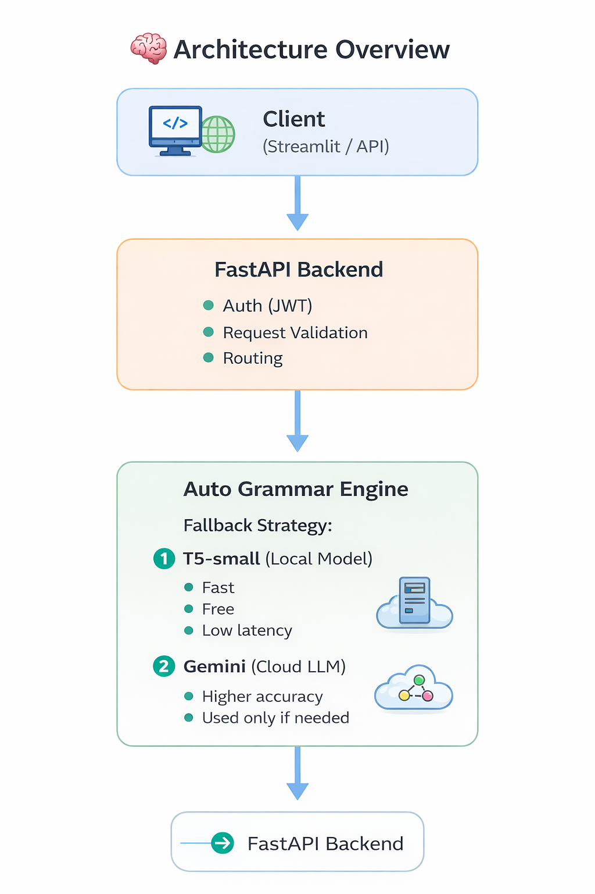

# 🧠 Linga Bot — AI Grammar Correction System

Linga Bot is a **production-style AI grammar correction system** built with **FastAPI**, combining a **locally fine-tuned T5 model** with a **cloud-based Gemini fallback** for improved accuracy and reliability.

The project demonstrates **end-to-end ML engineering**, from model fine-tuning to secure API deployment and frontend integration.

---

## 🚀 Features

- ✅ Fine-tuned **T5-small** model for grammar correction  
- 🔁 **Automatic fallback**: T5 → Gemini  
- 🔐 **JWT-based authentication** (register / login)  
- ⚡ FastAPI backend with modular service design  
- 🖥️ Streamlit frontend for interactive usage  
- 🔒 Secure environment variable handling  
- 📦 Easily extensible to OpenAI or other LLMs  

---

## 🏗️ Project Structure
```

LINGA\_BOT/  
│  
├── app/ # FastAPI backend  
│ ├── auth/ # JWT auth logic  
│ ├── db/ # Fake DB (upgradeable)  
│ ├── model/ # T5 model wrapper  
│ ├── routes/ # API routes  
│ ├── services/ # T5, Gemini, auto-fallback  
│ ├── utils/ # Security utilities  
│ └── main.py # App entry point  
│  
├── frontend/  
│ └── streamlit.py # Streamlit UI  
│  
├── requirements.txt  
├── .env.example  
└── README.md

```
---

## 🧠 Architecture Overview



**Design principle:**  
> *Local-first inference for cost & latency, cloud fallback for quality.*

---
## 🔁 Engine Fallback Logic

1. Attempt correction using **T5 (local model)**
2. If output is weak or fails → fallback to **Gemini**
3. Return first successful correction
4. If all engines fail → controlled error response

This makes the system **resilient and cost-aware**.

---

## 🔐 Authentication Flow

- `POST /register` → create user  
- `POST /login` → receive JWT token  
- Protected routes require:
```

Authorization: Bearer <JWT\_TOKEN>

```
---

## 📡 API Endpoints

### Register
```http
POST /register
```

### Login

```http
POST /login
```

### Grammar Correction (Manual Engine)

```http
POST /correct?text=your_text&engine=t5
POST /correct?text=your_text&engine=google
```

### Grammar Correction (Auto Fallback)

```http
POST /correct/auto?text=your_text
```

---

## 🖥️ Frontend (Streamlit)

Run:

```bash
streamlit run frontend/streamlit.py
```

Features:

-   Login & token handling
    
-   Text input for grammar correction
    
-   Engine selection (`auto`, `t5`, `google`)
    
-   Displays corrected output + engine used
    

---

## ⚙️ Environment Variables

Create a `.env` file (DO NOT commit):

```env
GOOGLE_API_KEY=your_google_api_key
JWT_SECRET_KEY=your_secret_key
```

Example file provided:

```
.env.example
```

---

## 🧪 Run Locally

### 1️⃣ Install dependencies

```bash
pip install -r requirements.txt
```

### 2️⃣ Start backend

```bash
uvicorn app.main:app --reload
```

### 3️⃣ Open API docs

```arduino
http://127.0.0.1:8000/docs
```

---

## 🧩 Tech Stack

-   **Backend**: FastAPI, Python
    
-   **Models**: T5-small (fine-tuned), Gemini
    
-   **Auth**: JWT
    
-   **Frontend**: Streamlit
    
-   **ML**: Hugging Face Transformers
    
-   **Deployment-ready** architecture
    

---

## 🎯 Why This Project Matters

This project demonstrates:

-   ML model fine-tuning & inference
    
-   API-first system design
    
-   Secure auth integration
    
-   Cost-aware LLM usage
    
-   Production-style fallback strategies
    

Built for **real-world usage**, not just demos.

---

## 🔮 Future Improvements

-   Replace fake DB with MongoDB / PostgreSQL
    
-   Add engine health checks & quota guards
    
-   Side-by-side engine comparison UI
    
-   OpenAI integration (plug-and-play)
    
-   Dockerized deployment
    

---

## 👤 Author

**Harsha Vardhan Nandineni**  
Final-year CSE | AI & ML Enthusiast  
Focused on ML systems, backend engineering, and production AI


---
